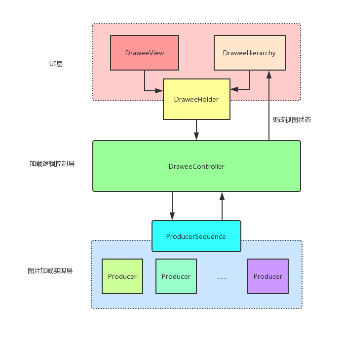
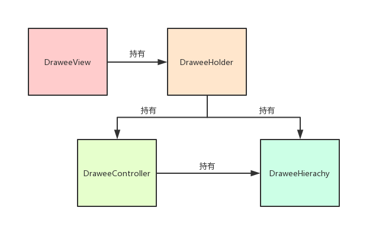
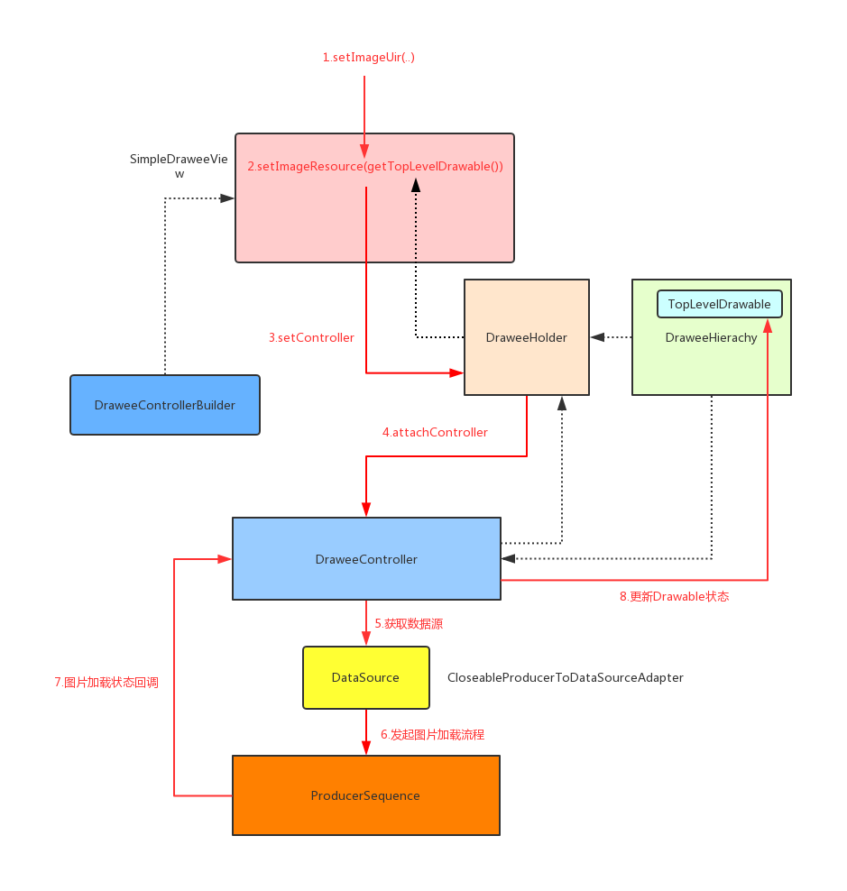
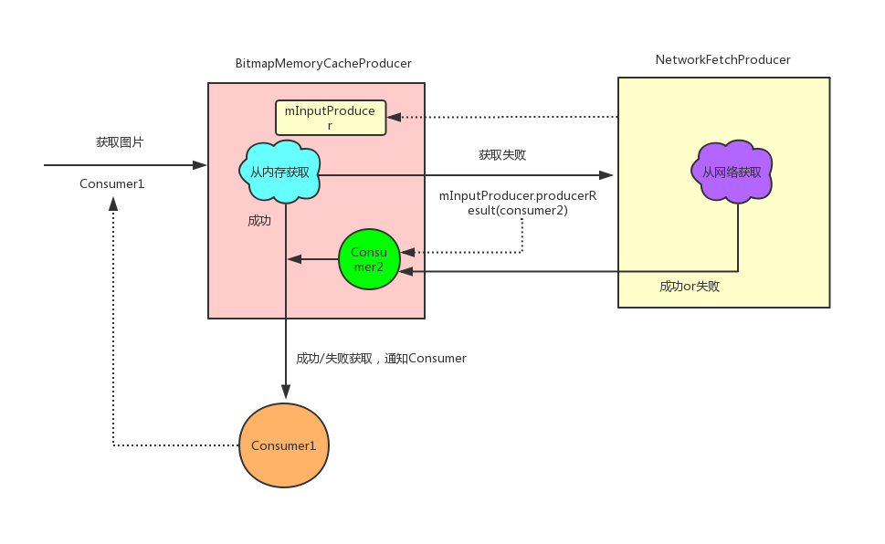
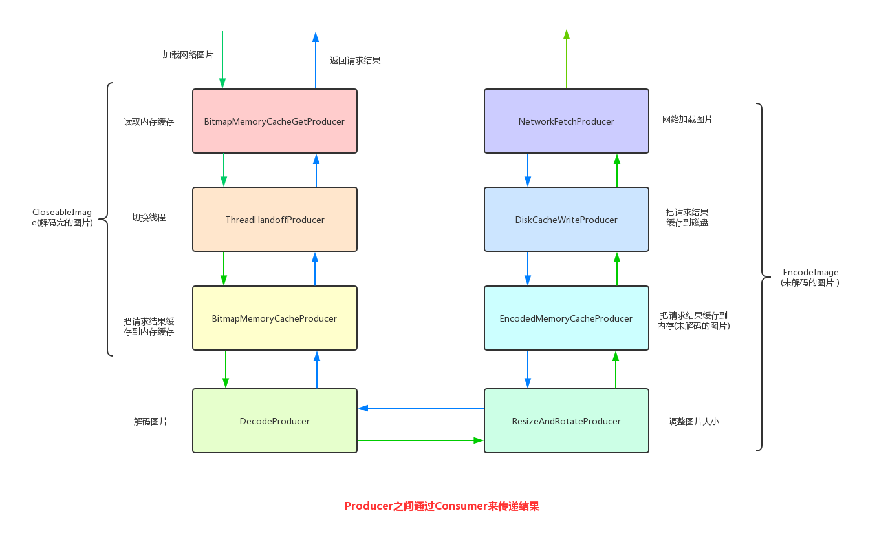

>本文是`Fresco`源码分析系列的开篇，主要分析`Fresco`的整体架构、各个组成模块的功能以及图片加载流程,希望通过本文可以对`Fresco`的整体框架设计有一个大概的了解，也为后续更为深入的分析打下基础。

`Fresco`源码庞大，涉及的图片加载情况众多。本系列`Fresco`源码分析是沿着**Fresco网络加载图片**这个点展开的。

# Fresco的整体架构

`Fresco`的组成结构还是比较清晰的，大致如下图所示:



下面结合代码分别解释一下上面各模块的作用以及大概的工作原理。

## UI层

### DraweeView

它继承自`ImageView`,是`Fresco`加载图片各个阶段过程中图片显示的载体，比如在加载图片过程中它显示的是占位图、在加载成功时切换为目标图片。不过后续官方可能不再让这个类继承`ImageView`。目前`DraweeView`与`ImageView`唯一的交集是:**它利用`ImageView`来显示`Drawable`** :

```
//DraweeView.setController()
public void setController(@Nullable DraweeController draweeController) {
    mDraweeHolder.setController(draweeController);
    super.setImageDrawable(mDraweeHolder.getTopLevelDrawable());  //super 就是 ImageView
}

//DraweeHolder.getTopLevelDrawable()
public @Nullable Drawable getTopLevelDrawable() {
    return mHierarchy == null ? null : mHierarchy.getTopLevelDrawable(); // mHierarchy 是 DraweeHierachy
}
```

`DraweeView.setController()`会在`Fresco`加载图片时会调用。其实在这里可以看出`Fresco`的图片显示原理是 : **利用`ImageView`显示`DraweeHierachy`的`TopLevelDrawable`**。上面这段代码引出了`UI层`中另外两个关键类:`DraweeHolder`和`DraweeHierachy`。

### DraweeHierachy

可以说它是`Fresco`图片显示的实现者。它的输出是`Drawable`，这个`Drawable`会被`DraweeView`拿来显示(上面已经说了)。它内部有多个`Drawable`，当前显示在`DraweeView`的`Drawable`叫做`TopLevelDrawable`。在不同的图片加载阶段，`TopLevelDrawable`是不同的(比如加载过程中是placeholder,加载完成是目标图片)。具体的`Drawable`切换逻辑是由它来具体实现的。

它是由`DraweeController`直接持有的，因此对于不同图片显示的切换操作具体是由`DraweeController`来直接操作的。

### DraweeHolder

它维护着`DraweeView`和`DraweeController`的`attach`关系(DraweeView只有attch了DraweeController才会具体加载网络图片的能力)。可以把它理解为`DraweeView`、`DraweeHierachy`和`DraweeController`这3个类之间的粘合剂,具体引用关系如下图:



## DraweeController : 加载逻辑控制层

它的主要功能是: **接收`DraweeView`的图片加载请求,控制`ProducerSequence`发起图片加载和处理流程,监听`ProducerSequence`加载过程中的事件(失败、完成等)，并更新最新的`Drawable`到`DraweeHierachy`**。

### DraweeController的构造逻辑

在`Fresco`中`DraweeController`是通过`DraweeControllerBuilder`来构造的。而`DraweeControllerBuilder`在`Fresco`中是以单例的形式存在的。`Fresco`在初始化时会调用下面的代码:

>Fresco.java
```
private static void initializeDrawee(Context context, @Nullable DraweeConfig draweeConfig) {
    sDraweeControllerBuilderSupplier = new PipelineDraweeControllerBuilderSupplier(context, draweeConfig);
    SimpleDraweeView.initialize(sDraweeControllerBuilderSupplier);
}
```

所以所有的`DraweeController`都是通过同一个`DraweeControllerBuilder`来构造的。`Fresco`每次图片加载都会对应到一个`DraweeController`，一个`DraweeView`的多次图片加载可以复用同一个`DraweeController`:

>SimpleDraweeView.java
```
public void setImageURI(Uri uri, @Nullable Object callerContext) {
    DraweeController controller =
        mControllerBuilder
            .setCallerContext(callerContext)
            .setUri(uri) //设置新的图片加载路径
            .setOldController(getController())  //复用 controller
            .build(); 
    setController(controller);
}
```

所以一般情况下 : **一个`DraweeView`对应一个`DraweeController`**。 


### 通过DataSource发起图片加载

在前面已经说了`DraweeController`是直接持有`DraweeHierachy`，所以它观察到`ProducerSequence`的数据变化是可以很容易更新到`DraweeHierachy`（具体代码先不展示了）。那它是如何控制`ProducerSequence`来加载图片的呢？其实`DraweeController`并不会直接和`ProducerSequence`发生关联。对于图片的加载，它直接接触的是`DataSource`，由`DataSource`进而来控制`ProducerSequence`发起图片加载和处理流程。下面就跟随源码来看一下`DraweeController`是如果通过`DataSource`来控制`ProducerSequence`发起图片加载和处理流程的。

>DraweeController发起图片加载请求的方法是(AbstractDraweeController.java):

```
protected void submitRequest() {
    mDataSource = getDataSource(); 
    final DataSubscriber<T> dataSubscriber = new BaseDataSubscriber<T>() { //可以简单的把它理解为一个监听者
        @Override
        public void onNewResultImpl(DataSource<T> dataSource) { //图片加载成功
            ...
        }
        ...
    };
    ...
    mDataSource.subscribe(dataSubscriber, mUiThreadImmediateExecutor); //mUiThreadImmediateExecutor是指 dataSubscriber 回调方法运行的线程，这里是主线程
}
```

那`DataSource`是什么呢？ `getDataSource()`最终会调用到:

>ImagePipeline.java
```
public DataSource<CloseableReference<CloseableImage>> fetchDecodedImage(ImageRequest imageRequest,...) {
     //获取加载图片的ProducerSequence
      Producer<CloseableReference<CloseableImage>> producerSequence = mProducerSequenceFactory.getDecodedImageProducerSequence(imageRequest);

      return submitFetchRequest(
          producerSequence,
          imageRequest,
          lowestPermittedRequestLevelOnSubmit,
          callerContext,
          requestListener);
}

private <T> DataSource<CloseableReference<T>> submitFetchRequest(...) {
    ...
    return CloseableProducerToDataSourceAdapter.create(roducerSequence, settableProducerContext, finalRequestListener);
}
```

所以`DraweeController`最终拿到的`DataSource`是`CloseableProducerToDataSourceAdapter`。这个类在构造的时候就会启动图片加载流程(它的构造方法会调用`producer.produceResults(...)`,这个方法就是图片加载的起点，我们后面再看)。

这里我们总结一下`Fresco`中`DataSource`的概念以及作用:**在`Fresco`中`DraweeController`每发起一次图片加载就会创建一个`DataSource`,这个`DataSource`用来提供这次请求的数据(图片)。`DataSource`只是一个接口，至于具体的加载流程`Fresco`是通过`ProducerSequence`来实现的。**

### Fresco图片加载前的逻辑

了解了上面的知识后，我们过一遍图片加载的源码(`从UI到DraweeController`),来理一下目前所了解的各个模块之间的联系。我们在使用`Fresco`加载图片时一般是使用这个API:`SimpleDraweeView.setImageURI(imageLink)`,这个方法最终会调用到:

>SimpleDraweeView.java
```
public void setImageURI(Uri uri, @Nullable Object callerContext) {
    DraweeController controller = mControllerBuilder
            .setCallerContext(callerContext)
            .setUri(uri)
            .setOldController(getController())
            .build();    //这里会复用 controller
    setController(controller);
}

public void setController(@Nullable DraweeController draweeController) {
    mDraweeHolder.setController(draweeController);
    super.setImageDrawable(mDraweeHolder.getTopLevelDrawable());  
}
```

即每次加载都会使用`DraweeControllerBuilder`来`build`一个`DraweeController`。其实这个`DraweeController`默认是复用的。然后会把`DraweeController`设置给`DraweeHolder`, 并在加载开始默认是从`DraweeHolder`获取`TopLevelDrawable`并展示到`DraweeView`。继续看一下`DraweeHolder`的逻辑:

>DraweeHolder.java
```
public @Nullable Drawable getTopLevelDrawable() {
    return mHierarchy == null ? null : mHierarchy.getTopLevelDrawable();
}

public void setController(@Nullable DraweeController draweeController) {
    detachController();

    mController = draweeController;
    ...
    mController.setHierarchy(mHierarchy); 

    attachController();
  }
```

在`DraweeHolder.setController()`中把`DraweeHierachy`设置给`DraweeController`,并重新`attachController()`,`attachController()`主要调用了`DraweeController.onAttach()`:

>AbstractDraweeController.java
```
public void onAttach() {
    ...
    mIsAttached = true;
    if (!mIsRequestSubmitted) {
      submitRequest();
    }
}

protected void submitRequest() {
    mDataSource = getDataSource(); 
    final DataSubscriber<T> dataSubscriber = new BaseDataSubscriber<T>() { //可以简单的把它理解为一个监听者
        @Override
        public void onNewResultImpl(DataSource<T> dataSource) { //图片加载成功
            ...
        }
        ...
    };
    ...
    mDataSource.subscribe(dataSubscriber, mUiThreadImmediateExecutor); //mUiThreadImmediateExecutor是指 dataSubscriber 回调方法运行的线程，这里是主线程
}
```

即通过`submitRequest()`提交了一个请求,这个方法我们前面已经看过了，它所做的主要事情就是，构造了一个`DataSource`。这个`DataSource`我们经过追踪，它的实例实际上是`CloseableProducerToDataSourceAdapter`。`CloseableProducerToDataSourceAdapter`在构造时就会调用`producer.produceResults(...)`,进而发起整个图片加载流程。

用下面这张图总结从`SimpleDraweeView`->`DraweeController`的图片加载逻辑:



到这里我们梳理完了`Fresco`在真正发起图片加载前所走的逻辑，那么`Fresco`的图片加载流程是如何控制的呢？到底经历了哪些步骤呢？

## 图片加载实现层

`Fresco`中有关图片的内存缓存、解码、编码、磁盘缓存、网络请求都是在这一层实现的,而所有的实现的基本单元是`Producer`,所以我们先来理解一下`Producer`:

### Producer

看一下它的定义:

```
/**
 * <p> Execution of image request consists of multiple different tasks such as network fetch,
 * disk caching, memory caching, decoding, applying transformations etc. Producer<T> represents
 * single task whose result is an instance of T. Breaking entire request into sequence of
 * Producers allows us to construct different requests while reusing the same blocks.
 */
public interface Producer<T> {

  /**
   * Start producing results for given context. Provided consumer is notified whenever progress is made (new value is ready or error occurs).
   */
  void produceResults(Consumer<T> consumer, ProducerContext context);
}
```

结合注释我们可以这样定义`Producer`的作用:**一个`Producer`用来处理整个`Fresco`图片处理流程中的一步，比如从网络获取图片、内存获取图片、解码图片等等**。而对于`Consumer`可以把它理解为监听者,看一下它的定义:

```
public interface Consumer<T> {
    ...
    void onNewResult(T newResult, @Status int status); //Producer处理成功

    void onFailure(Throwable t); //Producer处理失败
    ...
}
```

`Producer`的处理结果可以通过`Consumer`来告诉外界，比如是失败还是成功。

### Producer的组合

一个`ProducerA`可以接收另一个`ProducerB`作为参数，如果`ProducerA`处理完毕后可以调用`ProducerB`来继续处理。并传入`Consumer`来观察`ProducerB`的处理结果。比如`Fresco`在加载图片时会先去内存缓存获取，如果内存缓存中没有那么就网络加载。这里涉及到两个`Producer`分别是`BitmapMemoryCacheProducer`和`NetworkFetchProducer`，假设`BitmapMemoryCacheProducer`为`ProducerA`，`NetworkFetchProducer`为`ProducerB`。我们用伪代码看一下他们的逻辑:

>BitmapMemoryCacheProducer.java
```
public class BitmapMemoryCacheProducer implements Producer<CloseableReference<CloseableImage>> {

    private final Producer<CloseableReference<CloseableImage>> mInputProducer;

    // 我们假设 inputProducer在这里为NetworkFetchProducer
    public BitmapMemoryCacheProducer(...,Producer<CloseableReference<CloseableImage>> inputProducer) { 
        ...
        mInputProducer = inputProducer;
    }

    @Override
    public void produceResults(Consumer<CloseableReference<CloseableImage>> consumer,...) {
        CloseableReference<CloseableImage> cachedReference = mMemoryCache.get(cacheKey);

        if (cachedReference != null) { //从缓存中获取成功，直接通知外界
            consumer.onNewResult(cachedReference, BaseConsumer.simpleStatusForIsLast(isFinal));
            return; //结束处理流程
        }

        Consumer<CloseableReference<CloseableImage>> wrappedConsumer = wrapConsumer(consumer..); //包了一层Consumer，即mInputProducer产生结果时，它自己可以观察到
        mInputProducer.produceResults(wrappedConsumer, producerContext); //网络加载
    }
}
```

>NetworkFetchProducer.java
```
public class NetworkFetchProducer implements Producer<EncodedImage> {

    它并没有 inputProducer, 对于Fresco的图片加载来说如果网络都获取失败，那么就是图片加载失败了

    @Override
    public void produceResults(final Consumer<CloseableReference<CloseableImage>> consumer,..) {

        网路获取
        ...
        if(获取到网络图片){
            notifyConsumer(...); //把结果通知给consumer，即观察者
        }
        ...
    }
}
```

代码可能不是很好理解，可以结合下面这张图来理解这个关系:




`Fresco`可以通过组装多个不同的`Producer`来灵活的定义不同的图片处理流程的,多个`Producer`组装在一块称为`ProducerSequence(Fresco中并没有这个类哦)`。一个`ProducerSequence`一般定义一种图片处理流程,比如网络加载图片的`ProducerSequence`叫做`NetworkFetchSequence`,它包含多个不同类型的`Producer`。

### 网络图片加载的处理流程

在`Fresco`中不同的图片请求会有不同的`ProducerSequence`来处理，比如网络图片请求:

>ProducerSequenceFactory.java
```
private Producer<CloseableReference<CloseableImage>> getBasicDecodedImageSequence(ImageRequest imageRequest) {
    switch (imageRequest.getSourceUriType()) {
        case SOURCE_TYPE_NETWORK: return getNetworkFetchSequence();
        ...
}
```

所以对于网络图片请求会调用`getNetworkFetchSequence`:

```
/**
* swallow result if prefetch -> bitmap cache get -> background thread hand-off -> multiplex ->
* bitmap cache -> decode -> multiplex -> encoded cache -> disk cache -> (webp transcode) ->
* network fetch.
*/
private synchronized Producer<CloseableReference<CloseableImage>> getNetworkFetchSequence() {
    ...
    mNetworkFetchSequence = new BitmapCacheGetToDecodeSequence(getCommonNetworkFetchToEncodedMemorySequence());
    ...
    return mNetworkFetchSequence;
}
```

`getNetworkFetchSequence`会经过重重调用来组合多个`Producer`。这里我就不追代码逻辑了，直接用下面这张图来描述`Fresco`网络加载图片的处理流程:




可以看到`Fresco`的整个图片加载过程还是十分复杂的。并且上图我只是罗列一些关键的`Producer`,其实还有一些我没有画出来，有兴趣可以去源码细细探讨一下。


OK,到这里本文算是结束了，希望你可以通过本文对`Fresco`的设计在整体上有一定的了解。后续文章会继续讨论`Fresco`的缓存逻辑、图片压缩、`DraweeHierachy`的`Drawable`切换逻辑等。欢迎继续关注。

**欢迎关注我的[Android进阶计划](https://github.com/SusionSuc/AdvancedAndroid)看更多干货**

**欢迎关注我的微信公众号:susion随心**


