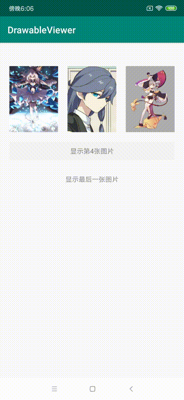

为了优化App的图片查看体验，做成类似微信/B站的图片查看效果。刚开始我在github上做了一番搜索，也确实找到了几个类似的高star的库，不过都在我打算拿来用时发现不能满足我的需求，因此打算自己实现一下这个功能。

# 实现

## 需要实现的功能

1. 类似共享元素的入场&退场动画(图片在入场时给人一种渐渐展开的效果)
2. 拖拽&双击退出图片查看
3. 支持缩放手势
4. 支持查看长图
5. 支持查看原图 & 下载原图
6. 高扩展性，同样的交互效果可以直接用在视频浏览上
7. API接口简单，可以很方便的接入到工程中
8. 支持显示GIF & 可复用Glide的Bitmap内存缓存
9. 避免OOM

为了实现上面所列举的功能，主要思路是:

1. 实现共享元素 & 拖拽交互动画
2. 使用[PhotoView](https://github.com/chrisbanes/PhotoView)库实现**图片缩放&长图浏览**
3. 使用**Glide**图片加载

## API

业务使用的API都位于`DraggableImageViewerHelper`中。

## 查看一张图片

```
DraggableImageViewerHelper.showSimpleImage(context, imageUrl, mIv1)
```

## 查看多张图片

```
DraggableImageViewerHelper.showImages(context, listOf(mImagesIv1, mImagesIv2, mImagesIv3), imags, index)
```

# 实现细节

## 共享元素入场&退场动画、拖拽退出

对于**动画 & 拖拽**的实现都抽取放到了`DraggableZoomCore`这个类中。这个类主要实现了:

1. 接收一个`View`,对`View`做共享元素入场 & 退出 动画
2. 响应用户拖拽手势, 改变`View`的大小和位置

### 共享元素入场&退场动画

思路很简单: **在一个新的`Activity`中，把`View`的位置放到用户点击时的位置，然后做一个不断变大的动画**，不过这里需要注意刘海屏的适配。

```
fun enterWithAnimator(animatorCallback: EnterAnimatorCallback? = null) {
    val dx = mCurrentTranslateX - 0
    val dy = mCurrentTransLateY - mTargetTranslateY
    val dWidth = mContainerWidth - draggableParams.viewWidth
    val dHeight = maxHeight - draggableParams.viewHeight
    val enterAnimator = ValueAnimator.ofFloat(0f, 1f)).apply {
        duration = ANIMATOR_DURATION
        addUpdateListener {
            val percent = it.animatedValue as Float
            mCurrentTranslateX = draggableParams.viewLeft + dx * percent
            mCurrentTransLateY = draggableParams.viewTop + dy * percent
            mCurrentWidth = draggableParams.viewWidth + (dWidth * percent).toInt()
            mCurrentHeight = draggableParams.viewHeight + (dHeight * percent).toInt()
            mAlpha = (mAlpha * percent).toInt()
            changeChildViewAnimateParams()
        }

    }
    enterAnimator.start()
}

private fun changeChildViewAnimateParams() {
    scaleDraggableView.apply {
        layoutParams = layoutParams?.apply {
            width = mCurrentWidth
            height = mCurrentHeight
        }
        translationX = mCurrentTranslateX
        translationY = mCurrentTransLateY
        scaleX = mCurrentScaleX
        scaleY = mCurrentScaleY
    }
    actionListener?.currentAlphaValue(mAlpha)
}
```

## 响应用户拖拽

这个也很简单, 就是根据用户的手势，不断调用`changeChildViewAnimateParams()`方法。

## PhotoView 的特殊处理

### 事件交互冲突

由于`PhotoView`可以响应用户的缩放手势和长图查看，因此在事件上会和`DraggableZoomCore`有一定的冲突,在自定义的图片查看类`DraggableImageView`中定义的如下解决规则:

```
/**
* 拖拽支持
* */
override fun onInterceptTouchEvent(ev: MotionEvent): Boolean {
    val isIntercept = super.onInterceptTouchEvent(ev)
    if (draggableZoomCore?.isAnimating == true) {  //做动画
        return true
    }
    if (mDraggableImageViewPhotoView.scale != 1f) { //PhotoView做了缩放
        return false
    }
    if (!mDraggableImageViewPhotoView.attacher.displyRectIsFromTop()) { //photo view显示长图，但此时没有显示到顶部
        return false
    }
    if (mDraggableImageViewViewOProgressBar.visibility == View.VISIBLE) {// loading 时不允许拖拽退出
        return false
    }
    return draggableZoomCore?.onInterceptTouchEvent(isIntercept, ev) ?: false
}

override fun onTouchEvent(event: MotionEvent): Boolean {
    draggableZoomCore?.onTouchEvent(event)
    return super.onTouchEvent(event)
}
```

### PhotoView显示长图时，如何判断当前显示在图片的顶部

这个主要是因为: 浏览长图时只有用户浏览到顶部，才允许响应用户的拖拽退出事件。可是`PhotoView`并没有提供这种方法，无奈只好浏览源码，加上这个边界判断方法:

可以在`PhotoViewAttacher`中添加下面代码:

```
// 判断当前 photo view 是否显示在图片的顶部
public boolean displyRectIsFromTop() {
    final RectF rect = getDisplayRect(getDrawMatrix());
    if (rect == null) return true;
    return rect.top >= 0;
}
```

大概原理就是如果`PhotoView`当前的显示区域`getDisplayRect(getDrawMatrix())`的top大于0是，就证明当前显示在图片的最上部。

### 解决`CENTER_CROP`时长图的入场动画问题

由于给`PhtotView`设置的图片`scale_type`为`CenterCrop`，这就造成了在播放入场动画时对于长图来说，是从中间渐渐展开的。这是很明显不符合我们直观上的体验的。
我希望的效果是:**PhtotView是CenterCrop, 但是是从图片的顶部CenterCrop的**。查看`PhotoView`的API发现并没有支持，因此不得不通过对源码做一定的修改来实现这个功能。查看`PhotoView`的源码可以发现，控制这部分feature的代码位于`PhotoViewAttacher.updateBaseMatrix()`中:


```
   private void updateBaseMatrix(Drawable drawable) {
        if (drawable == null) {
            return;
        }
        final float viewWidth = getImageViewWidth(mImageView);
        final float viewHeight = getImageViewHeight(mImageView);
        final int drawableWidth = drawable.getIntrinsicWidth();
        final int drawableHeight = drawable.getIntrinsicHeight();
        mBaseMatrix.reset();
        final float widthScale = viewWidth / drawableWidth;
        final float heightScale = viewHeight / drawableHeight;
        if (mScaleType == ScaleType.CENTER) {
            mBaseMatrix.postTranslate((viewWidth - drawableWidth) / 2F, (viewHeight - drawableHeight) / 2F);
        } else if (mScaleType == ScaleType.CENTER_CROP) {
            float scale = Math.max(widthScale, heightScale);
            mBaseMatrix.postScale(scale, scale);

//            mBaseMatrix.postTranslate((viewWidth - drawableWidth * scale) / 2F,
//                    (viewHeight - drawableHeight * scale) / 2F);

            //FIX  长图时，保证图片从最开始显示
            float screenWhRadio = Utils.getScreenWidth() * 1f / Utils.getScreenHeight();
            float imageWhRadio = drawableWidth *1f / drawableHeight;

            if (imageWhRadio < screenWhRadio){
                mBaseMatrix.postTranslate(0f, 0f);
            }else {
                mBaseMatrix.postTranslate((viewWidth - drawableWidth * scale) / 2F,
                        (viewHeight - drawableHeight * scale) / 2F);
            }
        } 
```

即上面我判断了图片的宽高比，如果是小于屏幕宽高比的话就不做`postTranslate((viewWidth - drawableWidth * scale) / 2F,(viewHeight - drawableHeight * scale) / 2F)`。

## 复用 Glide 内存缓存 & 避免OOM

对于一些大图，由于其size远超我们的屏幕，因此我们需要对下载下来的图片做一些裁剪来避免OOM:

```
Glide.with(context)
        .load(url)
        .apply(options)
        .into(object : SimpleTarget<Drawable>() {
            override fun onResourceReady(
                resource: Drawable,
                transition: Transition<in Drawable>?
            ) {
                if (resource is GifDrawable) {
                    Glide.with(context).load(url).into(mDraggableImageViewPhotoView) //支持 GIF
                } else {
                    mDraggableImageViewPhotoView.setImageBitmap(translateToFixedBitmap(resource))
                }
            }
        })
```

图片裁剪:

```
private fun translateToFixedBitmap(originDrawable: Drawable): Bitmap? {

    val whRadio = originDrawable.intrinsicWidth * 1f / originDrawable.intrinsicHeight

    val screenWidth =  Utils.getScreenWidth()
    //宽度默认为PhotoView容器的宽度，最大为屏幕的宽度
    var bpWidth = if (this@DraggableImageView.width != 0) this@DraggableImageView.width else screenWidth

    if (bpWidth > screenWidth) bpWidth = screenWidth

    val bpHeight = (bpWidth * 1f / whRadio).toInt()

    //复用 Glide 内存缓存
    //长图的话，降低图片质量
    var bp = Glide.get(context).bitmapPool.get(
        bpWidth,
        bpHeight,
        if (bpHeight > 5000) Bitmap.Config.RGB_565 else Bitmap.Config.ARGB_8888
    )

    if (bp == null) {
        bp = Bitmap.createBitmap(
            bpWidth,
            bpHeight,
            Bitmap.Config.ARGB_8888
        )
    }

    val canvas = Canvas(bp)
    originDrawable.setBounds(0, 0, bpWidth, bpHeight)
    originDrawable.draw(canvas)

    return bp
}
```

上面这段避免`OOM`的代码处理的比较简单，不过还是基本上可以杜绝OOM问题的。


## 查看原图 & 下载图片

### 查看原图

```
private fun loadAvailableImage(startAnimator: Boolean) {

    val thumnailImg = draggableImageInfo!!.thumbnailImg
    val originImg = draggableImageInfo!!.originImg

    val wifiIsConnect = Utils.isWifiConnected(context)

    val originImgInCache = GlideHelper.imageIsInCache(context, originImg)

    val targetUrl = if (wifiIsConnect || originImgInCache) originImg else thumnailImg

    GlideHelper.checkImageIsInMemoryCache(
        context,
        thumnailImg
    ) { inCache ->
        if (inCache && startAnimator) {  //只有缩略图在缓存中时，才播放缩放入场动画
            loadImage(thumnailImg, originImgInCache)
            draggableZoomCore?.enterWithAnimator(object :
                DraggableZoomCore.EnterAnimatorCallback {
                override fun onEnterAnimatorEnd() {
                    loadImage(targetUrl, originImgInCache)
                }
            })

        } else {
            loadImage(targetUrl, originImgInCache)
        }
    }
}
```

即:

1. 只用在缩略图在内存缓存中时才会播放入场动画。 (这个缩略图就是在列表中显示的图片)
2. 在wifi下回自动加载原图

### 下载图片

下载很简单，主要是保存图片时要让用户在相册和其他app中立刻看到保存的图片有一点机型适配的问题:

```
 private fun saveImageToGallery(context: Context, file: File) {
    try {
        MediaStore.Images.Media.insertImage(
            context.contentResolver,
            file.absolutePath, file.name, null
        )
    } catch (e: FileNotFoundException) {
        e.printStackTrace()
    }

    // 通知图库更新
    MediaScannerConnection.scanFile(context, arrayOf(file.absolutePath), null) { path, uri ->
        val mediaScanIntent = Intent(Intent.ACTION_MEDIA_SCANNER_SCAN_FILE)
        mediaScanIntent.data = uri
        context.sendBroadcast(mediaScanIntent)
    }
}
```

上面这段代码，用google一搜还是很容易找的的。

## End

OK上面就是整个实现过程。我在刚开始实现时感觉难度应该不大，不过实现过程成还是遇到许多问题(当然不止文章中介绍到的这些)，一点一点处理后还是学到很多东西的。

[GitHub源码](https://github.com/SusionSuc/DraggableImageViewer)

实现的效果如下:





