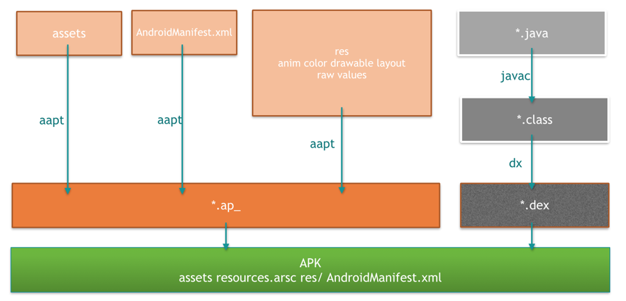

>本文继续分析[booster](https://github.com/didi/booster)的实现原理。更多相关文章见[booster-分析](https://github.com/SusionSuc/AdvancedAndroid/blob/master/booster%E6%A1%86%E6%9E%B6%E5%88%86%E6%9E%90/README.md)

`booster-task-compression`这个组件主要做了3件事:

1. 删除冗余的图片资源
2. 压缩图片资源
3. 重新压缩`resourceXX.ap_`文件中的资源

在分析它们的实现之前，我们先来了解一下Android的资源编译过程:

## 回顾 App 资源编译步骤



对于资源编译有哪些步骤我并没有找到比较详细官方文档，不过我们可以通过查看`com.android.tools.build:gradle`的源码来了解这个过程。构建一个`app`包所涉及的到`GradleTask(比如assembleRelease)`的源码大概位于`ApplicationTaskMamager.java`文件中:

>ApplicationTaskManager.java
```
@Override
public void createTasksForVariantScope(final TaskFactory tasks, final VariantScope variantScope) {

    BaseVariantData variantData = variantScope.getVariantData();
    ...
    // Create all current streams (dependencies mostly at this point)
    createDependencyStreams(tasks, variantScope);

    ...
    // Add a task to process the manifest(s)
    recorder.record(
            ExecutionType.APP_TASK_MANAGER_CREATE_MERGE_MANIFEST_TASK,
            project.getPath(),
            variantScope.getFullVariantName(),
            () -> createMergeApkManifestsTask(tasks, variantScope));

    ...

    // Add a task to merge the resource folders
    recorder.record(
            ExecutionType.APP_TASK_MANAGER_CREATE_MERGE_RESOURCES_TASK,
            project.getPath(),
            variantScope.getFullVariantName(),
            (Recorder.VoidBlock) () -> createMergeResourcesTask(tasks, variantScope, true));

    // Add a task to merge the asset folders
    recorder.record(
            ExecutionType.APP_TASK_MANAGER_CREATE_MERGE_ASSETS_TASK,
            project.getPath(),
            variantScope.getFullVariantName(),
            () -> createMergeAssetsTask(tasks, variantScope, null));

    
    recorder.record(
            ExecutionType.APP_TASK_MANAGER_CREATE_PROCESS_RES_TASK,
            project.getPath(),
            variantScope.getFullVariantName(),
            () -> {
                // Add a task to process the Android Resources and generate source files
                createApkProcessResTask(tasks, variantScope);

                // Add a task to process the java resources
                createProcessJavaResTask(tasks, variantScope);
            });
    ...
}
```

上面我只截取了`ApplicationTaskMamager.createTasksForVariantScope()`部分代码，`createTasksForVariantScope()`就是用来创建很多`Task`来构建一个可运行的`App`的。通过这个方法我们可以看到构建一个`App`包含下列步骤:

1. 下载依赖
2. 合并`Manifest`文件(`MergeApkManifestsTask`)
3. 合并`res`资源(`MergeResourcesTask`)
4. 合并`assets`资源(`MergeAssetsTask`)
5. 处理资源,生成`_.ap`文件(`ApkProcessTesTask`)

>上面我省略了很多步骤没有列出来。

**booster资源压缩的实现原理就是创建了一些`Task`插入在上面的步骤之间来完成自定义的操作**

## 冗余资源的删除

这个操作会在`app构建`完成`MergeResourcesTask`之后进行:

```
//移除冗余资源的 task， 执行位于资源合并之后
val klassRemoveRedundantFlatImages = if (aapt2) RemoveRedundantFlatImages::class else RemoveRedundantImages::class

val reduceRedundancy = variant.project.tasks.create("remove${variant.name.capitalize()}RedundantResources", klassRemoveRedundantFlatImages.java) {
    it.outputs.upToDateWhen { false }
    it.variant = variant
    it.results = results
    it.sources = { variant.scope.mergedRes.search(pngFilter) }
}.dependsOn(variant.mergeResourcesTask)
```

即会根据当前不同的`AAPT`版本创建不同的冗余图片移除任务(操作的图片格式为`png`, 但不包括`.9.png`)。

### AAPT 的冗余资源的移除

如果对资源编译采用的是`AAPT`，则执行的任务为`RemoveRedundantImages`:

```
open class RemoveRedundantImages: DefaultTask() {

    lateinit var variant: BaseVariant

    lateinit var results: CompressionResults

    lateinit var sources: () -> Collection<File>

    @TaskAction
    open fun run() {
        TODO("Reducing redundant resources without aapt2 enabled has not supported yet")
    }
}
```

可以看到`RemoveRedundantImages`并没有做什么具体的操作。实际上`gradle`会在`AAPT`资源合并操作之前移除冗余的资源，具体规则是:

>默认情况下,`Gradle`会合并同名的资源，如可能位于不同资源文件夹中的同名可绘制对象。这一行为不受`shrinkResources`属性控制，也无法停用，因为当多个资源与代码查询的名称匹配时，有必要利用这一行为来避免错误。只有在两个或更多个文件具有完全相同的资源名称、类型和限定符时，才会进行资源合并。`Gradle`会在重复项中选择它认为最合适的文件（根据下述优先顺序），并且只将这一个资源传递给`AAPT`，以便在APK文件中分发。

>`Gradle`会在以下位置查找重复资源：
>- 与主源集关联的主资源，通常位于 src/main/res/。
>- 变体叠加,来自编译类型和编译特性。
>- 库项目依赖项。

>`Gradle`会按以下级联优先顺序合并重复资源 : 依赖项 → 主资源 → 编译特性 → 编译类型

更具体的合并规则可查看: [合并重复资源](https://developer.android.com/studio/build/shrink-code#merge-resources)

**当然`gradle`的资源合并操作是必须的**

### AAPT2 的冗余资源的移除

>`Android Gradle Plugin 3.0.0`及更高版本默认会启用`AAPT2`。相较于`AAPT`,`AAPT2`会利用增量编译加快app打包过程中资源的编译。对于`AAPT2`更加详细的介绍可以参考 : https://developer.android.com/studio/command-line/aapt2

当`app`编译使用的是`AAPT2`时,`booster RemoveRedundantFlatImages`的处理:

```
internal open class RemoveRedundantFlatImages : RemoveRedundantImages() {
    @TaskAction
    override fun run() {
        val resources = sources().parallelStream().map {
            it to it.metadata
        }.collect(Collectors.toSet())

        resources.groupBy({
            it.second.resourceName.substringBeforeLast('/')   // 同文件夹下的文件
        }, {
            it.first to it.second
        }).forEach { entry ->
            entry.value.groupBy({
                it.second.resourceName.substringAfterLast('/')
            }, {
                it.first to it.second
            }).map { group ->
                group.value.sortedByDescending {
                    it.second.config.screenType.density // 按密度降序排序
                }.takeLast(group.value.size - 1)  //同名文件，取密度最大的
            }.flatten().parallelStream().forEach {
                try {
                    if (it.first.delete()) {  // 删除冗余的文件
                        val original = File(it.second.sourcePath)
                        results.add(CompressionResult(it.first, original.length(), 0, original))
                    } else {
                        logger.error("Cannot delete file `${it.first}`")
                    }
                } catch (e: IOException) {
                    logger.error("Cannot delete file `${it.first}`", e)
                }
            }
        }
    }
}
```

`RemoveRedundantFlatImages`所做的操作是: **在资源合并后，对于同名的png图片，它会取`density`最高的图片，然后把其他的图片删除**

比如你有下面3张启动图:

- mipmap-hdpi -> ic_launcher.png
- mipmap-xhdpi -> ic_launcher.png
- mipmap-xxxhdpi -> ic_launcher.png

经`booster`处理后就会剩下`mipmap-xxxhdpi -> ic_launcher.png`这一张图片打包到apk中。

## 图片资源的压缩

`booster`图片压缩的大致实现是:

1. 对于`minSdkVersion > 17`的应用，在资源编译过程中使用`cwebp`命令将图片转为`webp`格式。
2. 对于`minSdkVersion < 17`的应用，在资源编译过程中使用`pngquant`命令对图片进行压缩。

对于这两个工具的详细了资料可以参考下面文章:

> webp使用指南 : https://developers.google.com/speed/webp/docs/using

> pngquant使用实践 : https://juejin.im/entry/587f14378d6d810058a18e1f

### 具体实现

图片资源的压缩分为两步:

1. `assets`下的图片资源压缩
2. `res`下的图片资源压缩

>这里直接压缩**assets**下图片资源是存在一些问题的:如果工程中引入了`flutter`,`flutter`中对图片资源是明文引用的,`booster`将图片转为`webp`格式的话会造成`flutter`中图片失效。因此这点要注意。

这里就不去跟源码的详细步骤了，因为涉及的点很多。其实主要实现就是**创建一个Task, 将图片文件转为webp**

以`res`的资源压缩为例, 会执行到下面的代码:

```
nternal open class CwebpCompressImages : CompressImages() {

    open fun compress(filter: (File) -> Boolean) {
        sources().parallelStream().filter(filter).map { input ->
            val output = File(input.absolutePath.substringBeforeLast('.') + ".webp")
            ActionData(input, output, listOf(cmdline.executable!!.absolutePath, "-mt", "-quiet", "-q", "80", "-o", output.absolutePath, input.absolutePath))
        }.forEach {
            val s0 = it.input.length()
            val rc = project.exec { spec ->
                spec.isIgnoreExitValue = true
                spec.commandLine = it.cmdline
            }
            when (rc.exitValue) {

            }
        }
    }
}
```

`cmdline.executable!!.absolutePath`就是代表`cwbp`命令的位置。

## 重新压缩`resourceXX.ap_`文件中的资源

这个操作的入口代码是:

```
class CompressionVariantProcessor : VariantProcessor {
    override fun process(variant: BaseVariant) {

        variant.processResTask.doLast {
            variant.compressProcessedRes(results)   //重新压缩.ap_文件
            variant.generateReport(results)  //生成报告文件
        }  

        ...
    }
}
```

`compressProcessedRes()`的具体实现是:

```
private fun BaseVariant.compressProcessedRes(results: CompressionResults) {
    val files = scope.processedRes.search {
        it.name.startsWith("resources") && it.extension == "ap_"
    }
    files.parallelStream().forEach { ap_ ->
        val s0 = ap_.length()
        ap_.repack {
            !NO_COMPRESS.contains(it.name.substringAfterLast('.')) 
        }
        val s1 = ap_.length()
        results.add(CompressionResult(ap_, s0, s1, ap_))
    }
}
```

即找到所有的`resourcesXX.ap_`文件,然后对他们进行重新压缩打包。`ap_.repack`方法其实是把里面的每个文件都重新压了一遍(已经压过的就不再压了):

```
private fun File.repack(shouldCompress: (ZipEntry) -> Boolean) {
    //创建一个新的 .ap_ 文件
    val dest = File.createTempFile(SdkConstants.FN_RES_BASE + SdkConstants.RES_QUALIFIER_SEP, SdkConstants.DOT_RES)

    ZipOutputStream(dest.outputStream()).use { output ->
        ZipFile(this).use { zip ->
            zip.entries().asSequence().forEach { origin ->
                // .ap_ 中的文件再压缩一遍
                val target = ZipEntry(origin.name).apply {
                    size = origin.size
                    crc = origin.crc
                    comment = origin.comment
                    extra = origin.extra
                    //如果已经压缩过就不再压缩了
                    method = if (shouldCompress(origin)) ZipEntry.DEFLATED else origin.method
                }

                output.putNextEntry(target)

                zip.getInputStream(origin).use {
                    it.copyTo(output)
                }
                ..
            }
        }
    }

    //覆盖掉老的.ap_文件
    if (this.delete()) {
        if (!dest.renameTo(this)) {
            dest.copyTo(this, true)
        }
    }
}
```

对`resourcesXX.ap_`文件的压缩报告如下:

```
46.49% xxx/processDebugResources/out/resources-debug.ap_  153,769 330,766 xxx/out/resources-debug.ap_
```

压缩前:391KB , 压缩后:177KB; 即压缩了`46.49%`

## 压缩总结

我新建了一个`Android`工程，在使用`booster`压缩前打出的apk大小为`2.8MB`, 压缩后打出的apk大小为`2.6MB`。

实际上`booster-task-compression`这个组件对于减小`apk`的大小还是有很显著的效果的。不过是否是适用于项目则需要根据项目具体情况来考虑。


更多文章见 : [AdvancedAdnroid](https://github.com/SusionSuc/AdvancedAndroid)

